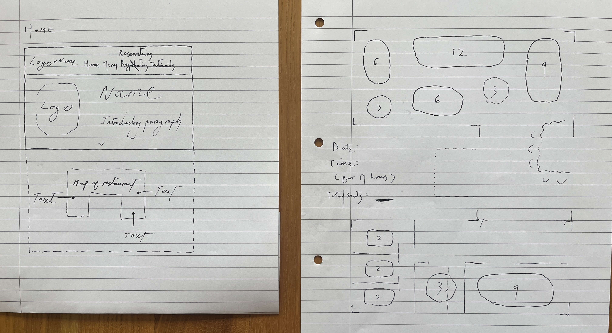
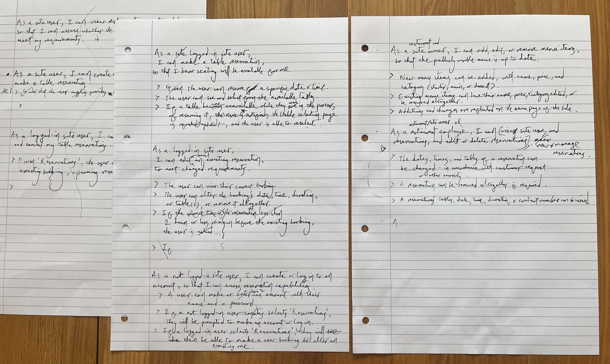
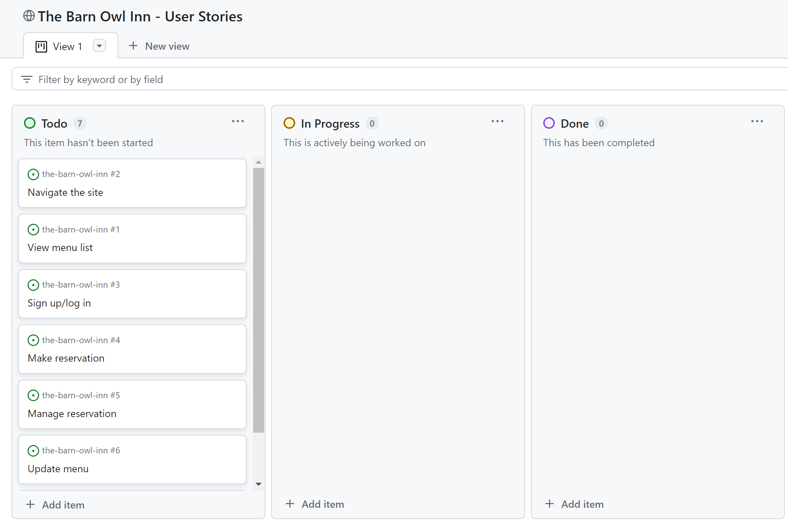

# The Barn Owl Inn

## Design Stage

### Wireframes

I sketched initial wireframes of the home page and of the tables selection screen that will be a key part of the reservation process.

### User Stories

I planned my user stories and their acceptance criteria on paper, with some conversational assistance from a relative - who has experience of converting ideas in to formulaic written forms. I then transferred them to a GitHub Projects kanban board.

## Development Stage

### Initial Workspace Setup

I pip-installed Django and other essential dependencies, and pip-froze them to a requirements file:

> `pip3 install Django~=4.2.1 gunicorn~=20.1 dj-database-url~=0.5 psycopg2~=2.9`
>
> `pip3 freeze --local > requirements.txt`

I started a project and then an app:

> `django-admin startproject barn_owl_inn .`
>
> `python3 manage.py startapp home`

In my project's settings file, I added my app to the list of installed apps.

I ran a server:

> `python3 manage.py runserver`

I opened it in browser, copied the relevant string from the error message, ended the server with Ctrl-C, and pasted the string in the empty allowed hosts list, again within the settings file. I preemptively added '.herokuapp.com' to the list.

I will also be changing debug to False before each git commit.

## Deployment Stage

## .gitignore and .slugignore

I named the readme_images directory in a slugignore file, because the screenshots and photos in this readme will not be required by the deployed site. [Heroku's documentation](https://devcenter.heroku.com/articles/slug-compiler#ignoring-files-with-slugignore) suggests that this should cause that directory's "files to be removed after you push code to Heroku and before the buildpack runs", so that large, unnecessary files are not included.

## Credit

- As mentioned above, a relative helped with phrasing and structuring my user stories/acceptance criteria.
