# The Barn Owl Inn

## Design Stage

### Wireframes

I sketched initial wireframes of the home page and of the tables selection screen that will be a key part of the reservation process.

### User Stories/Acceptance Criteria

I planned my user stories and their acceptance criteria on paper, with some conversational assistance from a relative - who has experience of converting ideas in to formulaic written forms. I then transferred them to a GitHub Projects kanban board.

### Entity Relationship Diagrams

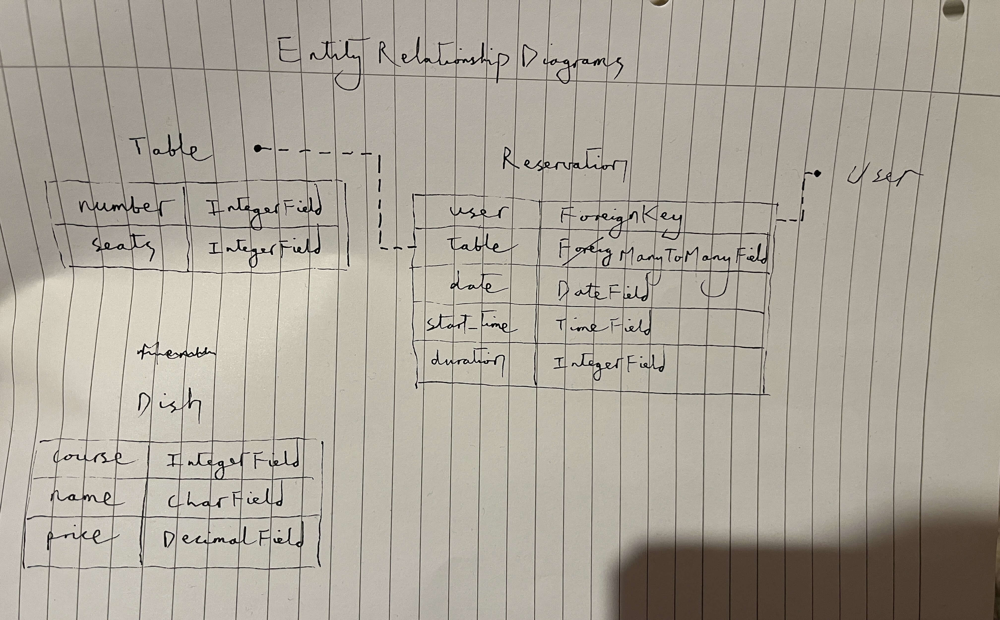

## Development Stage

### Initial Workspace Setup

I pip-installed Django and other essential dependencies, and pip-froze them to a requirements file:

> `pip3 install Django~=4.2.1 gunicorn~=20.1 dj-database-url~=0.5 psycopg2~=2.9`
>
> `pip3 freeze --local > requirements.txt`

I started a project and then an app:

> `django-admin startproject barn_owl_inn .`
>
> `python3 manage.py startapp home`

In `barn_owl_inn/settings.py`, I added 'home' to the list of installed apps.

I ran a server:

> `python3 manage.py runserver`

I opened it in browser, copied the relevant string from the error message, ended the server with Ctrl-C, and pasted the string in the empty allowed hosts list, again within the settings file. I preemptively added '.herokuapp.com' to the list.

I will also be changing debug to False before each git commit.

### Base template

On my user stories board, I moved 'Navigate the site' to the In Progress column.

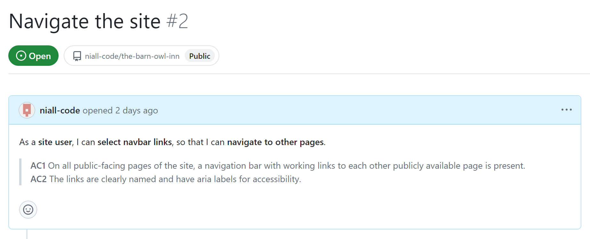

I created `/templates/base.html` and `/home/templates/home/index.html`, putting HTML boilerplate in the former and `` in the latter, which is DTL (Django Templating Language).

I also created `/static/css/style.css`, `/static/images`, and `static/js/script.js`. Then, I could add a link element to the head of the base template and give it a href of ``, ready for applying CSS styles.

I like to have a live preview open while styling, to immediately see the changes. Since my project is not wired up yet, style changes were not being reflected, so an additional vanilla HTML link element has been added, which will be removed shortly.

I added an unordered list navigation menu to the base template and styled it in to a navbar.

### Home page

Through a fluid process combining experimenting, reviewing Django debugging messages, and consulting paper notes I had made or other files of code I had written, I managed to get to a point where a bare home page with a navbar is displayed upon running the server.

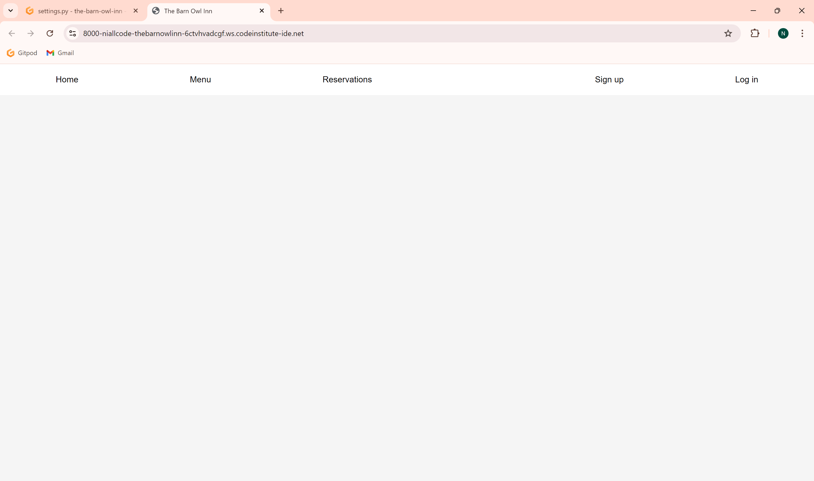

This entailed additions to `barn_owl_inn/settings.py`, to `barn_owl_inn/urls.py`, the creation of `home/urls.py`, additions to `home/views.py`, to `home/templates/home/index.html`, and to `templates/base.html`, as well as changes to `static/css/styles.css`. All of these insertions and alterations will be captured in the 5th git commit (28 July '24), and are additionally reflected in these handwritten pages that I wrote also for my own future reference:

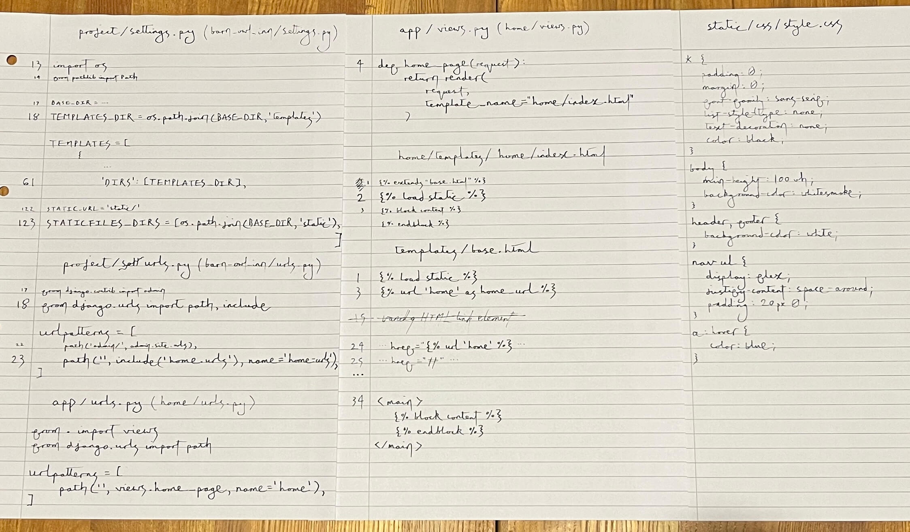

### Database Connection

I created a git-ignored `env.py` file, in which I set the URL of a PostgreSQL cloud database and a randomly-generated secret key. If env exists, it is imported in `settings.py`. Settings gets the database URL and secret key from the environment variables.

I activated database tables and registered admin:

> `python3 manage.py migrate`
>
> `python3 manage.py createsuperuser`

### Writing Database Model Classes

I started 2 more apps, 'menu' and 'reserve', and added them to the installed apps.

I moved 'View menu list' and 'Update menu' user stories to In Progress column.

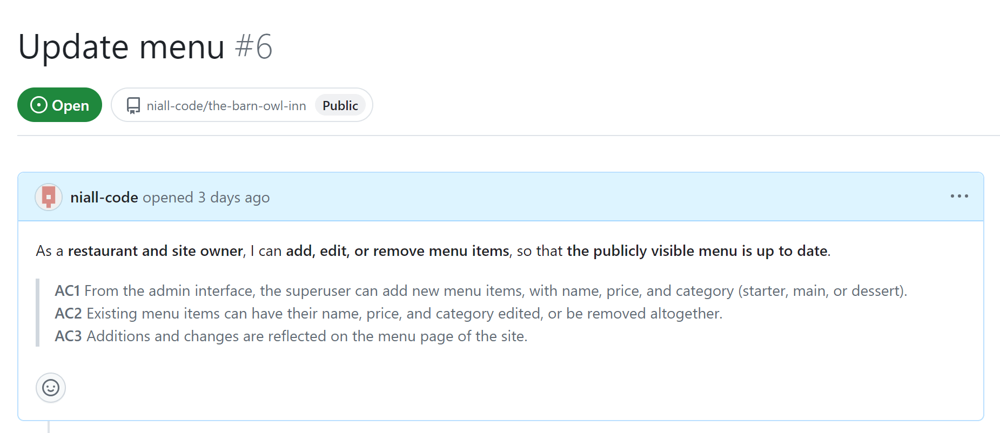

I wrote my Table, Reservation, and Dish models in the appropriate `models.py` files of the two new apps. I then migrated them to the database:

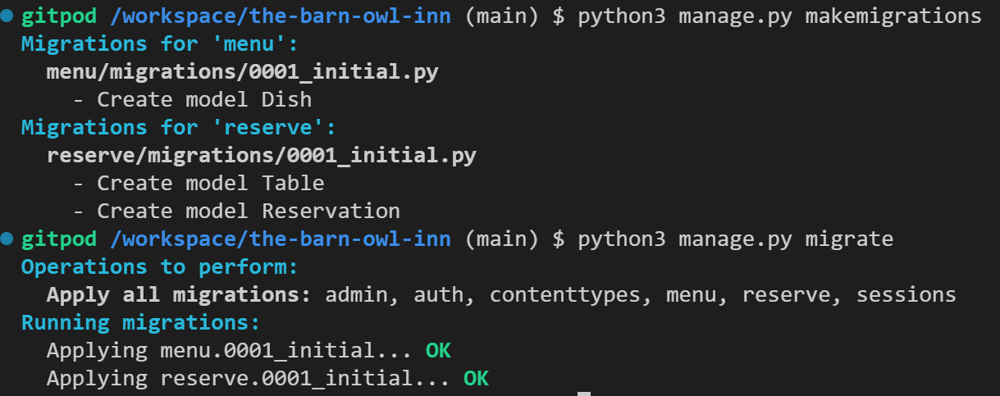

### Adding Dishes to the Database

I registered the new models in the `admin.py` files of their apps and added a CSRF_TRUSTED_ORIGINS constant to the project's settings file. Then I ran the server and opened in browser, appended `/admin` to the URL, and logged in as the superuser. Now I, the developer, can add a number of example dishes (i.e., instances of the Dish class) to the database, and a future owner could add more just as easily - bringing the 'Update menu' user story close to fulfilment.

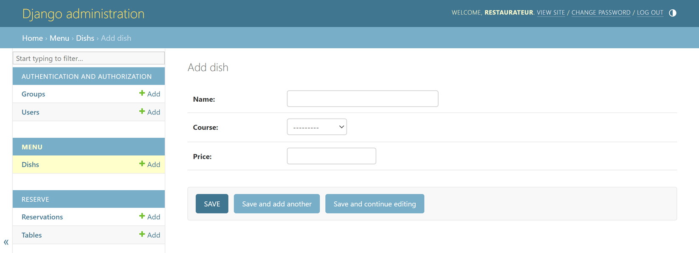

An existing dish can be edited (to alter the price, for example) in a very similar manner, after selecting it from the dish list in the admin panel as shown here:

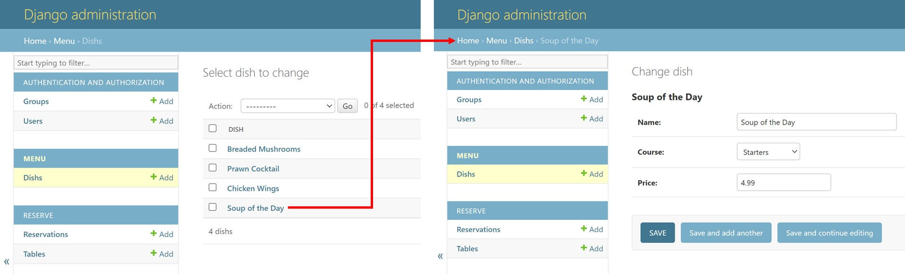

#### Input Requirements/Restrictions

By purposefully inputting invalid data while adding new dishes, I manually tested:

- that `unique=True` had done as expected and prevented the name attributes of two different instances of the Dish class (now acting as a database schema) from being identical,

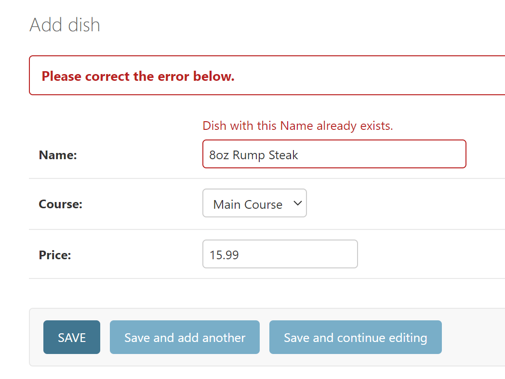

- that `blank=False` had indeed prevented the course field from being left empty,

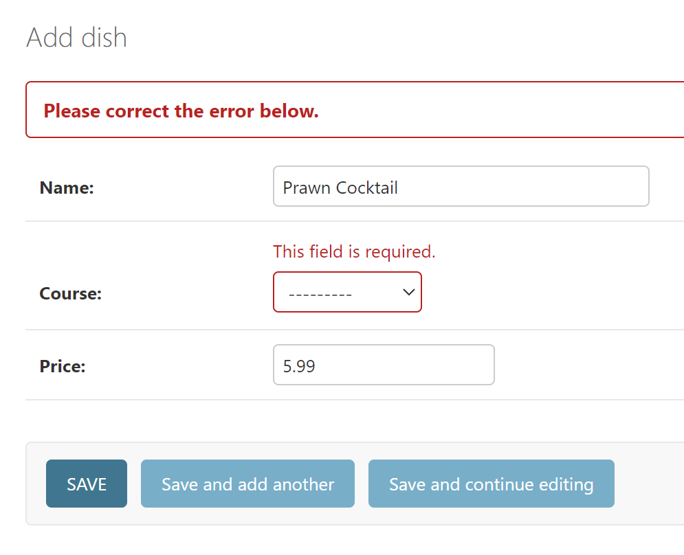

- that `max_digits=4` prevents an unrealistically high price from being entered, given that two decimal places were included,

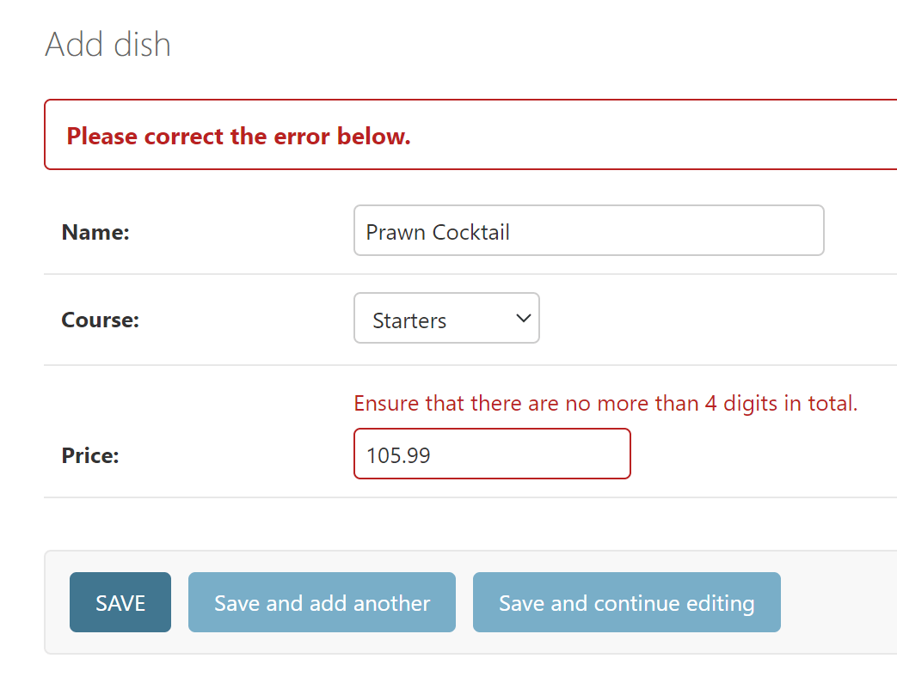

- and that `decimal_places=2` made a third decimal place invalid, since real-world currency is being represented.

## Deployment Stage

## .gitignore and .slugignore

I named the readme_images directory in a slugignore file, because the screenshots and photos in this readme will not be required by the deployed site. [Heroku's documentation](https://devcenter.heroku.com/articles/slug-compiler#ignoring-files-with-slugignore) suggests that this should cause that directory's "files to be removed after you push code to Heroku and before the buildpack runs", so that large, unnecessary files are not included.

## Credit

- As mentioned above, a relative helped with phrasing and structuring my user stories/acceptance criteria.
