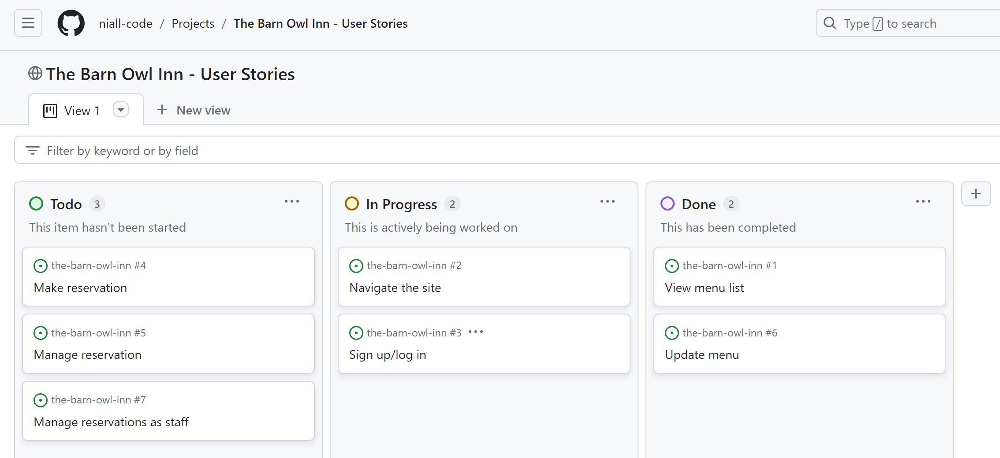
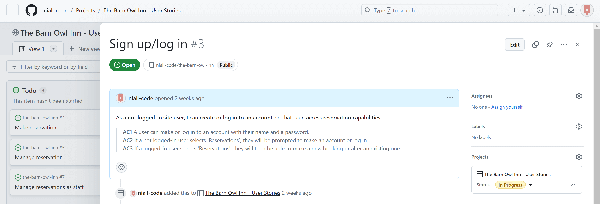
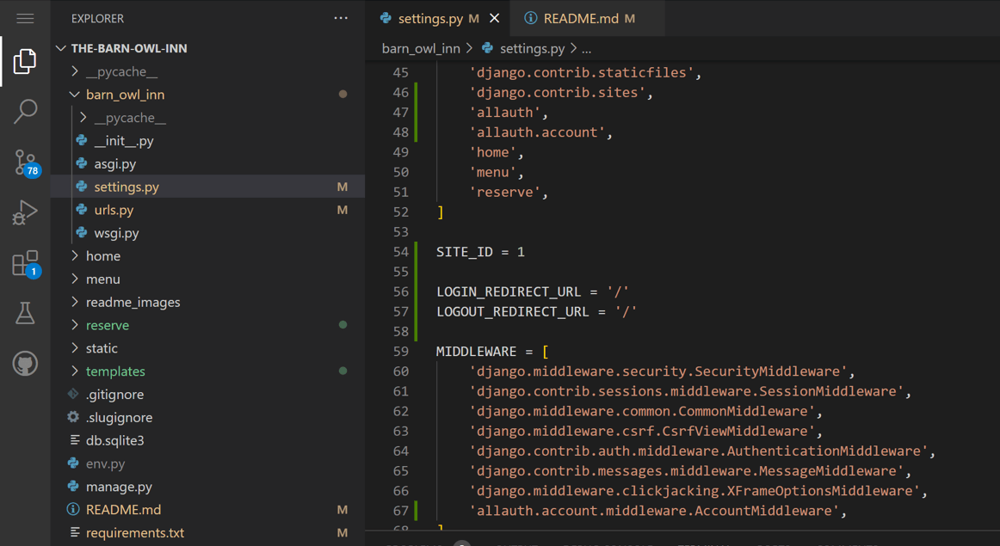
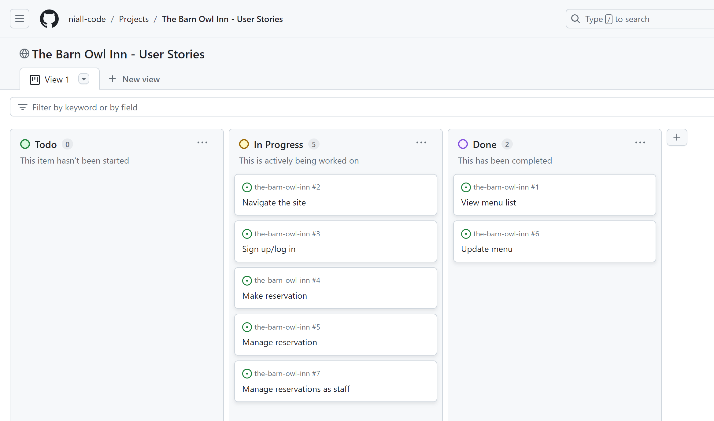
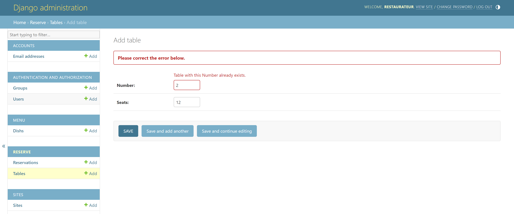
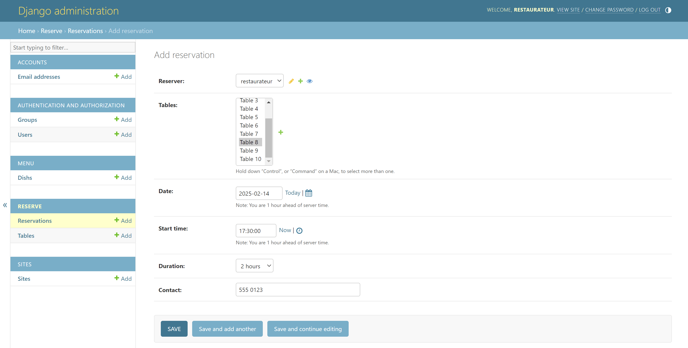
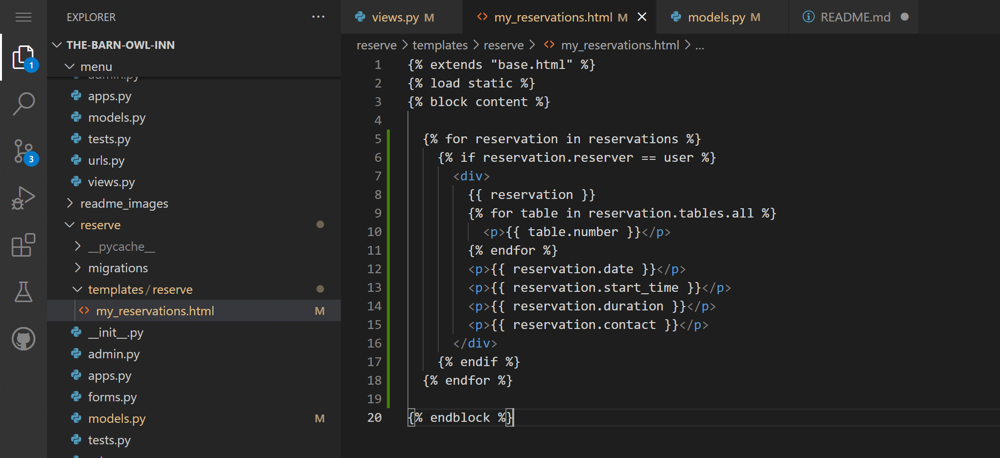
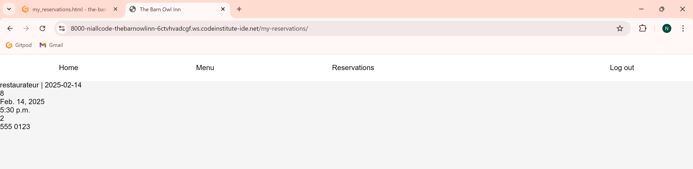
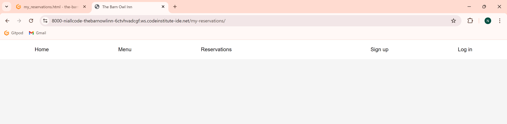

# The Barn Owl Inn

## Design Stage

### Wireframes

I sketched initial wireframes of the home page and of the tables selection screen that will be a key part of the reservation process.

### User Stories/Acceptance Criteria

I planned my user stories and their acceptance criteria on paper, with some conversational assistance from a relative - who has experience of converting ideas in to formulaic written forms. I then transferred them to a GitHub Projects kanban board.

### Entity Relationship Diagrams

## Development Stage

### Initial Workspace Setup

I pip-installed Django and other essential dependencies, and pip-froze them to a requirements file:

> `pip3 install Django~=4.2.1 gunicorn~=20.1 dj-database-url~=0.5 psycopg2~=2.9`
>
> `pip3 freeze --local > requirements.txt`

I started a project and then an app:

> `django-admin startproject barn_owl_inn .`
>
> `python3 manage.py startapp home`

In `barn_owl_inn/settings.py`, I added 'home' to the list of installed apps.

I ran a server:

> `python3 manage.py runserver`

I opened it in browser, copied the relevant string from the error message, ended the server with Ctrl-C, and pasted the string in the empty allowed hosts list, again within the settings file. I preemptively added '.herokuapp.com' to the list.

I will also be changing debug to False before each git commit.

### Base template

On my user stories board, I moved 'Navigate the site' to the In Progress column.

I created `/templates/base.html` and `/home/templates/home/index.html`, putting HTML boilerplate in the former and `` in the latter, which is DTL (Django Templating Language).

I also created `/static/css/style.css`, `/static/images`, and `static/js/script.js`. Then, I could add a link element to the head of the base template and give it a href of ``, ready for applying CSS styles.

I like to have a live preview open while styling, to immediately see the changes. Since my project was not wired up yet, style changes were not being reflected, so an additional vanilla HTML link element had been added - which was removed shortly after, once it became redundant.

I added an unordered list navigation menu to the base template and styled it in to a navbar.

### Home page

Through a fluid process combining experimenting, reviewing Django debugging messages, and consulting paper notes I had made or other files of code I had written, I managed to get to a point where a bare home page with a navbar is displayed upon running the server.

This entailed additions to `barn_owl_inn/settings.py`, to `barn_owl_inn/urls.py`, the creation of `home/urls.py`, additions to `home/views.py`, to `home/templates/home/index.html`, and to `templates/base.html`, as well as changes to `static/css/styles.css`. All of these insertions and alterations will be captured in the 5th git commit (28 July '24), and are additionally reflected in these handwritten pages that I wrote also for my own future reference:

### Database Connection

I created a git-ignored `env.py` file, in which I set the URL of a PostgreSQL cloud database and a randomly-generated secret key. If env exists, it is imported in `settings.py`. Settings gets the database URL and secret key from the environment variables.

I activated database tables and registered admin:

> `python3 manage.py migrate`
>
> `python3 manage.py createsuperuser`

### Writing Database Model Classes

I started 2 more apps, 'menu' and 'reserve', and added them to the installed apps.

I moved 'View menu list' and 'Update menu' user stories to In Progress column.

I wrote my Table, Reservation, and Dish models in the appropriate `models.py` files of the two new apps. I then migrated them to the database:

### Adding Dishes to the Database

I registered the new models in the `admin.py` files of their apps and added a CSRF_TRUSTED_ORIGINS constant to the project's settings file. Then I ran the server and opened in browser, appended `/admin` to the URL, and logged in as the superuser. Now I, the developer, can add a number of example dishes (i.e., instances of the Dish class) to the database, and a future owner could add more just as easily - bringing the 'Update menu' user story close to fulfilment.

An existing dish can be edited (to alter the price, for example) in a very similar manner, after selecting it from the dish list in the admin panel as shown here:

#### Input Requirements/Restrictions

By purposefully inputting invalid data while adding new dishes, I manually tested:

- that `unique=True` had done as expected and prevented the name attributes of two different instances of the Dish class (now acting as a database schema) from being identical,

- that `blank=False` had indeed prevented the course field from being left empty,

- that `max_digits=4` prevents an unrealistically high price from being entered, given that two decimal places were included,

- and that `decimal_places=2` made a third decimal place invalid, since real-world currency is being represented.

### Dish List on Menu Page

I began by imitating my notes from `readme_images/fifth_commit.jpg`. This entailed adding URL patterns to `barn_owl_inn/urls.py` (existing) and `menu/urls.py` (new), adding a basic rendering method to `menu/views.py`, creating `menu/templates/menu/menu.html` and having it extend the base template, and adding a href to the Menu link of `templates/base.html`'s navbar.

I went through a period of confusion, trying to replace what I had just written as a placeholder with more suitable "class-based views". A prior 'Django blog walkthrough project' seemingly had left me with the impression that class-based views were required when more than one database entry had to be drawn upon (e.g., thumbnails of all blog posts rather than a specific post, or list of all dishes rather than just one dish). After experimentation, note-checking, and research, I concluded that I was mistaken and my original code before this detour was closer to the solution.

After this return to my initial pathway, I soon managed to get my database's dish objects crudely displaying on the menu page as seen below - principally (on the back end) by adding a curly braces argument to the render method, allowing my `menu.html` file to read the dishes data and show it. This of course was coupled with putting some provisional DTL (Django Templating Language) into the HTML file - a for loop in the `` logic marker and variables in their `{{ }}` marker.

In the process, I realised that neither of the `views.py` files required a `template_name=` before the file path string.

I still had to work out how to get the starters, main course dishes, and desserts displaying under the appropriate headings. I had the epiphany that my `views.py` file's `menu_page` method could contain multiple variables. In other words, rather than just `dishes = Dish.objects.all()` and then trying to apply logic with DTL, I could and should have three separate variables: `starters = Dish.objects.filter(course=1)`, and so on. All three could be conveyed to the HTML file via the dictionary object that is the third argument of the render method.

To refine the outcome, I added further HTML tags and attributes and styled them in `static/css/style.css`. Some of the HTML has no visual effect but will improve accesibility, particularly `aria-labelledby`.

I can now move my 'View menu list' and 'Update menu' user stories to Done, as all of their acceptance criteria have been met.

### Reservations Page

I repeated the pattern once again of putting appropriate basics in the URL files and views file as pertains this time to the `reserve` app.

#### User Authentication

Since much of the functionality of the reservations section will be dependent on a user being registered and authenticated, it was now time to move the 'Sign up/Log in' user story to 'In Progress'.

I then installed the required user authentication package:

> `pip3 install django-allauth~=0.57.0`
>
> `pip3 freeze --local > requirements.txt`
>
> `pip3 show django-allauth`
>
> `cp -r <Location>/allauth/templates/* ./templates/`
>
> `pip3 manage.py showmigrations`
>
> `pip3 manage.py migrate`

On the first day of attempting the migrate command, there was an external database problem. Not definitively knowing that, I tried extensively to get it to work, but ultimately had to resume work the following day when the issue elsewhere had been addressed. It was at least reassuring that the command failing was no fault of my own.

I had also made appropriate additions to the settings file:

At this time, I could give a real href to the remaining navbar links in `base.html`. DTL if-else logic will mean that an unauthenticated user will see 'Sign up' and 'Log in' but a logged-in user will just see 'Log out' instead.

I also removed some of the automatic code in some of the relevant Django allauth template files, so that allauth could integrate better with my existing project. For example, I removed the rest of a path in front of 'base' so that my own custom base template is referenced instead where relevant.

#### Reservations Page Itself

I moved the remaining user stories to 'In Progress', as all pertain to the reservation functionalities.

From the admin panel, I created my instances of Table. In the process, I manually tested that two instances indeed cannot have the same table number, as shown here:

From the admin panel, I created a dummy reservation.

In `my_reservations.html`, I utilised DTL logic and variables to simply display the details of this reservation, but only to a logged-in user who was responsible for the reservation's creation.

- The Django Templating Language code:

- What was seen when still logged in with the superuser account:

- What was seen after logging out and again navigating to the reservations page:

## Deployment Stage

## .gitignore and .slugignore

I named the readme_images directory in a slugignore file, because the screenshots and photos in this readme will not be required by the deployed site. [Heroku's documentation](https://devcenter.heroku.com/articles/slug-compiler#ignoring-files-with-slugignore) suggests that this should cause that directory's "files to be removed after you push code to Heroku and before the buildpack runs", so that large, unnecessary files are not included.

## Credit

- As mentioned above, a relative helped with phrasing and structuring my user stories/acceptance criteria.
